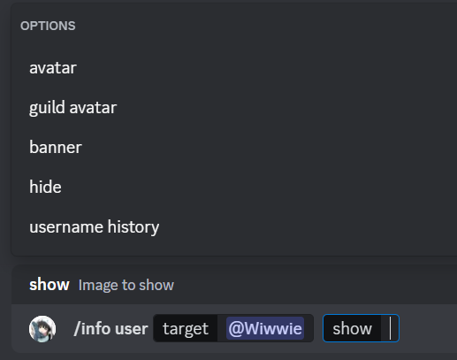
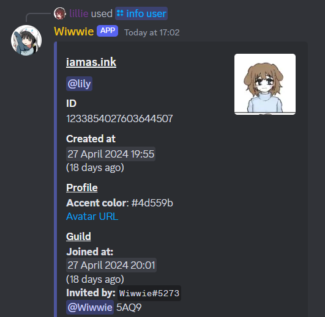
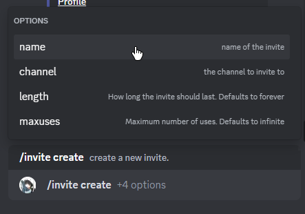

# lilysbot, aka Wiwwie
my discord bot :3  

Created to help me with moderation, with features that no other bot quite satisfied me with:
 - Detailed user info  
    <details><summary>Screenshot</summary></details>
    <details><summary>Screenshot</summary></details>
 - Invite tracking
    - /invite create  
        Create an invite with a friendly name, so you can see where users have been invited from.
         <details><summary>Screenshot</summary></details>
    - /invite list
        List all invites, optionally including expired ones
 - Basic server XP system
 - OpenAI API integration 


# Running in docker
See [docker-compose-example.yml](docker-compose-example.yml) for an example compose configuration.  
 - Clone this repo with 
```bash
git clone https://github.com/iamasink/lilysbot.git
```  
 - Edit docker-compose-example.yml
    - edit redis persistant data path
    - (optional) rename to docker-compose.yml
 - Run docker compose build  
 - Run docker compose up  

This will compile the typescript code and start the bot


# Running with nodemon (for development)
 - Clone this repo with 
```bash
git clone https://github.com/iamasink/lilysbot.git
```  
 - 
 ```bash
 cd lilysbot
 ```
 - Ensure you have a redis-stack database running (you can just run `docker compose up redis-stack`)
 - Set environment variables in package.json's nodemonConfig.env
 - Run with nodemon
 ```bash
 npx nodemon src/index.ts
 ```